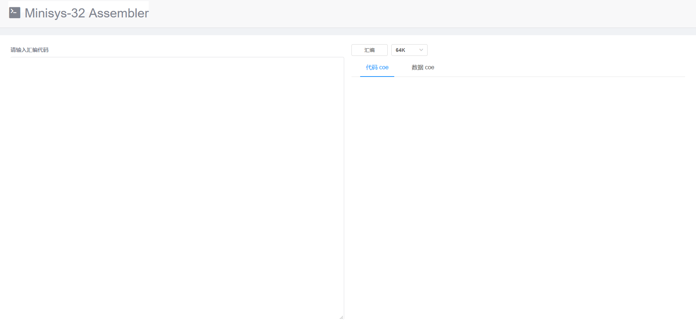
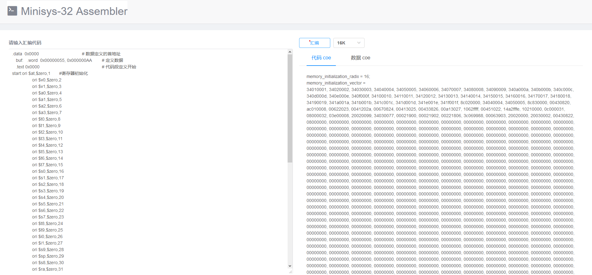

# minisys-assembler

This project is the 9-th task of the "Computer Design and Practice" course to implement a `Minisys` assembler. There is a one-to-one correspondence between assembly instructions and instructions, that is, the process of literal translation.

The core gui service is at [src/app/minisys-32-assembler](src/app/minisys-32-assembler) and the lib is at [src/app/minisys-32-assembler/assembler-lib](src/app/minisys-32-assembler/assembler-lib).

## GUI




## Installation

Ensure you have node and npm installed, then please install all the dependencies.

```bash
npm install
# or yarn
yarn install
```

## Usage

Start the gui services:

```bash
npm run start
```

Open your browser with the url `http://127.0.0.1:4200` the copy asm code to the left, select the memory size, than click `assemble`, you will get the `code coe` file and the `data coe` file.

## Test ASM File

See at [./cputest.asm](./cputest.asm).

## LICENSE

[MIT](./LICENSE)