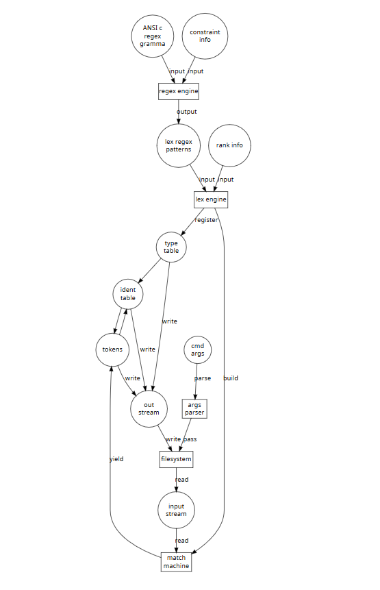
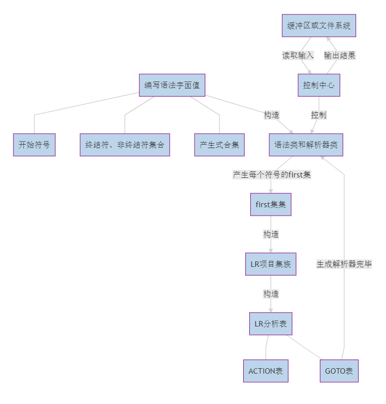

# Naive Compiler

本项目是 Rust 实现的 C89 Parser，由于实验第二部分强制要求使用 `LR(1)` 文法实现，C89 不满足该要求，此文法只能部分实现；因为部分实现的文法分析器无法重复利用，且 C 的代码生成相当复杂，后续实验将迁移到 `Object Ocaml` 语言上，见 [../yatc](yatc), 故以下仅作简要介绍。

本项目实现：

- [x] 基于组合子的正则引擎
- [x] 完整的面向 C89 的词法
- [x] 部分缺失的面向 C89 的文法分析器

## 基于组合子的正则引擎和词法分析

构造能够一个能够完成基本正则匹配功能的正则表达式引擎，该引擎保证了以下核心功能：连接，或，空，重复，不在某字符集中，单元匹配；并为便利考虑，增强了一些功能：正闭包、可选、字符串匹配、字符集匹配、字符串集匹配等。

利用该引擎，按照ANSI C 对应的正则文法构造对应的正则表达式模板，这个模板中需要携带有语言标准相关的限制信息（如该类token的最大字符数等），便于后续进行贪婪匹配。

构造完所有类型Token的正则模板后，分配优先级并利用携带的限制信息，对这些正则模板进行初步的融合，形成一个简易的综合匹配机。并生成一个编码表，向编码表注册已生成的正则模板。

从控制台读入命令行参数，利用参数中的相关文件路径信息打开对应文件，读取源文件为字符流。从流开始处为起点，利用综合匹配机从最大可匹配长度开始匹配，每个长度按照对应类别模板优先级依次匹配，若匹配成功，加入token流，起点后移对应长度。若至最小可匹配长度仍不可匹配，终止工作，向用户报告错误位置内容。

结合生成的token流和编码表，生成符号表，并向token流中标识符添加符号表的入口信息。
将token流、编码表、符号表以json格式写入指定文件中。

## 文法分析器

从预先写好的 `cparser` 子项目中的 `grammars` 类中读取 C 语言的文法，保存在一个大致类型为 `Vec<String,Vec<String>>` 的数组中，详细为产生式类的数组。

不停地扫描每个产生式，计算 `first 集合`，首字符为 `终结符` 则加入到对应 `非终结符` 的 `first 集`中；如是非，则扫描其 `first 集`，全部加入当前 `非终结符集`；空则继续扫描；直到某一次没有变更，则 `first 集` 计算完成。

接下来求 `LR1` 的 `项目集族`。从 `S->S’` 开始，构造第一个项目集，通过求闭包，构造转换函数，通过保证项目集族之前的不重复，可以求出所有的项目集。

构造 `LR1` 分析表，`ACTION` 和 `GOTO` 表可以组合，也可以分离 —— 前者通过结构体和整数实现，后者通过多个类、枚举和正整数实现。

分析过程用状态和符号栈实现，实际即为下推自动机的实现。
