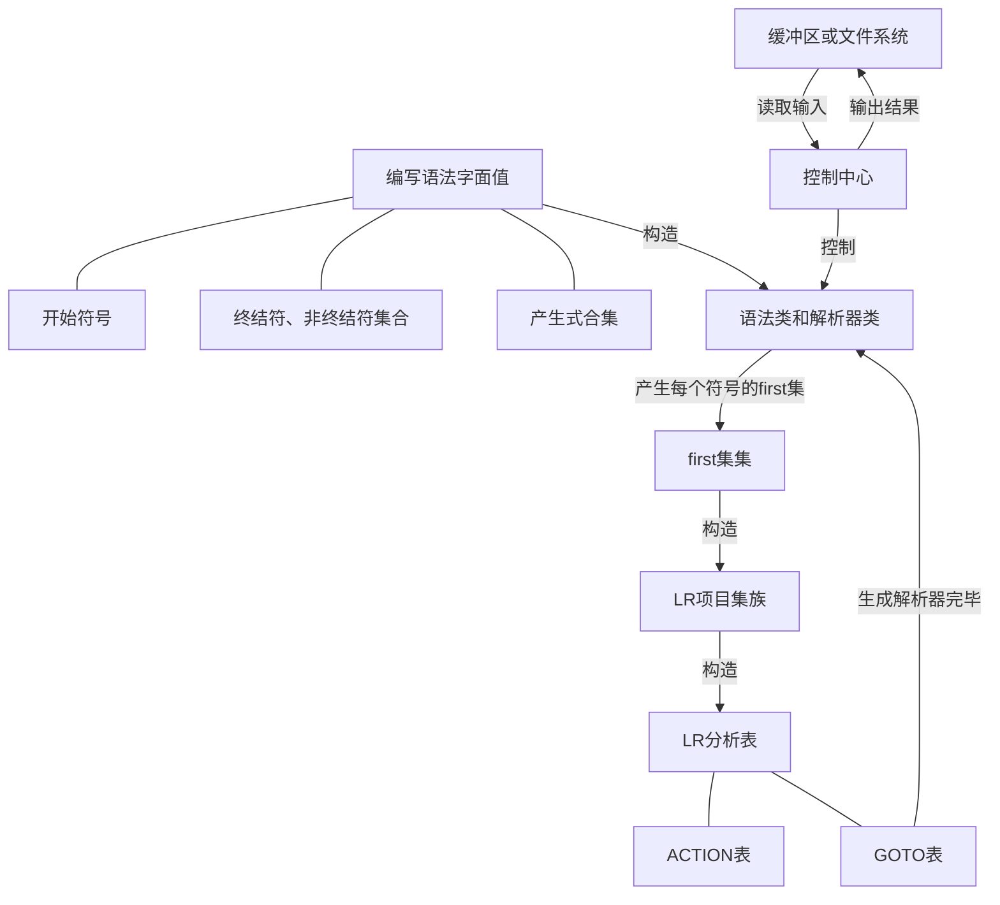

```mermaid
graph TD
A[编写语法字面值]---B[开始符号]
A---C["终结符、非终结符集合"]
A---D["产生式合集"]
A-->|构造|E[语法类和解析器类]
E-->|产生每个符号的first集|G[first集集]
G-->|构造|H[LR项目集族]
H-->|构造|I[LR分析表]
I---J[ACTION表]
I---K[GOTO表]
K-->|生成解析器完毕|E
L[缓冲区或文件系统]-->|读取输入|M
M[控制中心]-->|控制|E
M-->|输出结果|L
```