# YATC - Yet Another Tiny Compiler


## 👀 Overview

This project is my implementation of the tasks of Experiments 3 and 4 of the Compilation Principles course. Because the semantic rules of the C language are too large to finish it, I have to give up the results of experiments 1 and 2 and choose a simplified functional language as the goal from LLVM tutorial. Although it does not conform to LL (1), it can still be implemented without using pure recursion.

This experiment uses a `top-down + trick` translation approach.

1. Using `top-down + trick`, design translation schemes for grammatically correct word strings.
2. Use this translation scheme to write `processing routines` for each generation.
3. Use subroutines to generate `AST trees`.
4. Write the `intermediate code` for each type of tree node to generate subroutines.
5. Traverse the generated AST tree and call the generation subroutine to generate intermediate code.
6. Output the intermediate code sequence - `LLVM IR`
7. Use LLVM backend to `optimize` and `translate to machine code`
8. Intergrate all above

Goals and Task Status:

- [x] Parser
    - [x] Tokenizer
    - [x] AST Parser
- [x] Codegen
    - [x] Optimization
    - [x] IR gen
    - [x] ASM gen
    - [ ] My Own Pass
- [x] Driver & Intergration
    - [x] Token Mode
    - [x] AST Mode
    - [x] Interpreter Mode
    - [x] JIT Mode
    - [x] Compiler Mode

## 🔨 Install & Usage

Ensure you have `cargo`、`LLVM (required llvm-config)`、`rust toolchains` installed, then:

```shell
cargo build --release
```

Then run from `target/release/cli`:

```config
Usage: yatc [(-l | -p | -j | -i | -t)]
Options:
    -l  Run only lexer and show its output.
    -p  Run only parser and show its output.
    -j  Run only jit executor and show its output.
    -i  Run only interpreter executor and show its output.
    -t  Run only compiler and show its output.
```

## 📑 Modules

### Parser Module

It mainly contains the definition of the `ast node` type, the corresponding grammar, semantic parsing subroutines attached to the ast node, and some additional programs.

Each node definition is similar to the following, the type is determined by the node type, and other semantic and grammatical elements are included in the field.

```rust
#[derive(Debug, Clone, PartialEq, Serialize, Deserialize)]
pub enum ASTNode {
    ExternNode(Prototype),
    FunctionNode(Function),
}

#[derive(Debug, Clone, PartialEq, Serialize, Deserialize)]
pub struct Function {
    pub prototype: Prototype,
    pub body: Expression,
}
```

The parsing and translation function of each node is `parse_xxx`. For example, the following is the translation of the extern structure:

```rust
    tokens: &mut Vec<TokenType>,
    settings: &mut ParserSettings,
) -> PartParsingResult<ASTNode>；
```

### Codegen Module

It mainly includes code generator - codegen, context, constructor builder and module module, and code generation subroutines and their auxiliary functions corresponding to each type of node in ast.

For example, the following codegen method is designed for the `expression` node.

```rust
impl IRBuilder for parser::Expression {
    fn codegen(&self, gen: &mut Codegen, module: &mut Module) -> IRBuildingResult { 
        //...
    }
```

### Driver and Target Module

The `codegen` module is responsible for the optimization of function-level intermediate code. The `driver` module drives the assembly and integration of the entire compiler, and is responsible for selecting different stages and actuators for different operating parameters. The `target` module is responsible for the generation of optimized intermediate code to assembly code And machine-related optimization.

## 📙 The Language

### Basic lexical and grammatical descriptions

```rust
#[derive(Debug, Clone, PartialEq, Serialize, Deserialize)]
pub enum TokenType {
    If,
    Then,
    Else,
    For,
    In,
    OpeningParenthesis,
    ClosingParenthesis,
    Comma,
    Delimiter,
    Def,
    Extern,
    Binary,
    Unary,
    Var,
    Ident(String),
    Number(f64),
    Operator(String),
}
```

The functional programming language implements:

- if-then-else structure of branch expression
- Loop-for-in structure, equivalent to while, do while, loop break, can be implemented in user mode
- Priority symbol ()
- External function declaration extern
- Function definition def
- binary operator binary, a binary boolean expression can be realized by this equivalent
- The unary operator unary, a unary Boolean expression can be realized by this equivalent
- Number type
- Identifier type
- Variable declaration initialization var x = expression
- Variable assignment x = expression
- comma delimiter, indicating lexical interval
- Semicolon separator structure, ending ast unit
- Function call

Has the following syntax design:

```ebnf
- program          : [[statement | expression] Delimiter ? ]*;
- statement        : [declaration | definition];
- declaration      : Extern prototype;
- definition       : Def prototype expression;
- prototype        : Ident | Binary Op Number ? | Unary Op 
- OpeningParenthesis [Ident Comma ?]* ClosingParenthesis;
- expression       : [primary_expr (Op primary_expr)*];
- primary_expr     : [Ident | Number | call_expr | parenthesis_expr | conditional_expr | loop_expr | - unary_expr | var_expr
- call_expr        : Ident OpeningParenthesis [expression Comma ?]* ClosingParenthesis;
- parenthesis_expr : OpeningParenthesis expression ClosingParenthesis;
- conditional_expr : If expression Then expression Else expression;
- loop_expr        : For Ident Op= expression Comma expression [Comma expression]? In expression;
- unary_expr:      : Op primary_expr;
- var_expr         : Var Ident [Op= expression]? [Comma Ident [Op= expression]?]* In expression;
```

### Language Features

**(1) Functional language**: Everything except function declarations and definitions in this language are expressions, which can return values, and can be regarded as a kind of function, so most syntax units can be regarded as functions. For example, it can have the following assignment structure:

```ocaml
var x = ( var i=0,j=1 in i+j ) in … 
```

**(2) User-defined operators**: Only a few basic arithmetic operators and assignment operators are built into the language, such as `+` `-` `*` `<`, but users can easily expand the language. There are two types of operators that can be customized:

① The unary operator is defined as follows:

```ocaml
# defination
def unary!(v)  
    if v then
         0
    else
        1;
# usage
var x=1 in !x
```
So users can define their own negation, logical non-operator.

② The binary operator is defined as follows:

```ocaml
# defination
def binary| 5 (LHS RHS)
   if LHS then
     1
   else if RHS then
     1
   else
     0;
# usage
var x = 1, y = 0, z = 1 in (x < y | y < z)
```

Users can easily define their own binary expressions, and the user can decide the final priority when defining them.

Through user-defined operators, although the language does not define Boolean expressions natively, users can easily extend the entire Boolean expression system by themselves. Such as `!` Use custom unary operators, `&` use binary operators, etc.

**(3) Value type**: This language is a weakly typed language. Currently only real numbers are used as types in this language. Integers and logical values are simulated by real numbers.

## 📜 The Intermediate Language (IR)

In general, the compiler translates the source language into an `intermediate language (IR)`, which is then translated into the assembly language of the target platform using the back-end programs and devices.

Different from the three-address code in this experiment, the current common scheme of all the emerging languages-LLVM IR will be used. Currently, the languages ​​that use this solution by default include Mozilla's `Rust`, Apple's `Swift`, Jetbrains' `Kotlin`, etc. Popular tools using this solution include C / C ++ `Clang`, Lua's `LLVM Lua`, Webassembly's `Emscripten`, Ruby's `MacRuby`, Go `llgo`, `Tensorflow` for Python, etc.

`LLVM IR` is designed to be used in three different forms: compiled intermediate language (IR) in memory, bitcode stored on the hard disk, and a readable assembly language representation. In this way, LLVM will provide a powerful intermediate representation for efficient compilation transformation and analysis. In fact, the three different forms of LLVM are all equivalent. This document describes human-readable representations and symbols.

LLVM modularizes many excellent mechanisms of the compiler. People can customize the compiler for their own applications according to their language, processor, and operating platform. At the right time, they can quickly obtain a high-performance intermediate representation, and then link other Compile results or libraries to obtain executable code with performance, resource efficiency, and compatibility.

### `If` Expression

First enter the `entry` basic block, jump to `then` when `if_condition` is `true`, otherwise enter the `else` tag, and finally return the calculation result of the required expression according to the tag in `ifcont`.

```llir
entry:
  br if_condition true, label %then, label %else
then:                                             ; preds = %entry
  br label %ifcont
else:                                             ; preds = %entry
  br label %ifcont
ifcont:                                           ; preds = %else, %then
  %ifphi = phi double [ then_expression, %then ], [ else_expression, %else ]
```

### `For` Expression

In the entry block, first apply for a stack variable `%i`, which holds the value of the iteration. Save the value of `start_value` into it.

Then enter the `preloop` block, read the loop variable, and compare with `end_value` (there are more processes here, because the preset has only real types and needs to be transformed). If the iteration conditions are met, then the `loop branch` is entered, otherwise the `afterloop branch` is entered.

In the `loop branch`, the function body is executed first, then the loop variable is incremented according to the step value, and the jump to the `preloop branch` at the end.

At the end, it enters the `afterloop branch`, and the current `for` expression returns a constant value of 0.

```llir
entry:
  %i = alloca double
  store double start_valule, double* %i
  br label %preloop

preloop:                                          ; preds = %loop, %entry
  %i1 = load double, double* %i
  %cmptmp = fcmp ult double %i1, end_value

  %booltmp = uitofp i1 %cmptmp to double
  %loopcond = fcmp one double %booltmp, 0.000000e+00
  br i1 %loopcond, label %loop, label %afterloop

afterloop:                                        ; preds = %preloop
  ret double 0.000000e+00

loop:
loop_body;                                             ; preds = %preloop
  %i2 = load double, double* %i
  %nextvar = fadd double %i2, step_value
  store double %nextvar, double* %i
  br label %preloop
```

### Function Declaration

The function declaration is relatively simple, declare the leading, return value, function name, parameters.

```llir
declare double @f(double %param1)
```

### Function Definition

The basic form of a function definition is as follows. The `define` part is similar to the function declaration. After entering the `entry` block, first apply for stack space for each parameter, store it on the stack, then execute the function body, and finally take the value from the stack and return it.

```llir
define double @f(double %param1) {
entry:
  %x1 = alloca double
  store double %param1, double* %x1
  function_body
  %x2 = load double, double* %x1
  ret double %x2
}
```

### Function Call

The translation of a function call is of the form:

```llir
%calltmp = call double @function_name(double param1)
```

### Variable Declaration and Initialization

Variable declaration and initialization first apply for stack space, and then store the initial value in this address.

```llir
%a = alloca double
store double initialize_value, double* %a
```

### Variable Assignment

Variable assignment stores the target value in the variable address.

```llir
store double value, double* %a
```

### Variable Values and Basic Operators

The value of the variable is to take the variable from the corresponding address, and the basic operator corresponds to the basic intermediate instruction.

```llir
%i1 = load double, double* %i
%j2 = load double, double* %j
%addtmp = fadd double %i1, %j2
```

### Custom Operator Invocation

调用一元操作符即转换成调用一个变量的 `unary’operator_name’`，同理调用二元操作符即转换成调用两个变量的 `binary’ operator_name’`。

```llir
%unop = call double @"unary’operator_name’"(double param)
```

## Nested Initialization / Assignment

For example, for the following nested initializations:

```ocaml
var a=1 in var c=a in var z=c in z
```

That is, to apply for three spaces, first store the initialization value into the outermost variable, read the outermost value, store the intermediate variable address, read the intermediate variable value, and store the inner variable address. It is actually done through a combination of multiple subtypes.

```llir
%z = alloca double
%c = alloca double
%a = alloca double
store double 1.000000e+00, double* %a
%a1 = load double, double* %a
store double %a1, double* %c
%c2 = load double, double* %c
store double %c2, double* %z
%z3 = load double, double* %z
```

It is equivalent to a shorthand pattern:

```ocaml
var a=1,b=2,c=3 in (a-b)*(a+b)
```

### Boolean Expression

It is implemented by a custom operator, which is a function inside, and then achieves the same efficiency as handwriting through code optimization. For example, the following is the definition of binary AND.

```ocaml
def binary& 9 (LHS RHS) 
    if !LHS|!RHS then 0 else 1
```

The result with full optimization is as follows:

```llir
define double @"binary&"(double %LHS, double %RHS) {
entry:
  %RHS2 = alloca double, align 8
  store double %RHS, double* %RHS2, align 8
  %ifcond = fcmp ueq double %LHS, 0.000000e+00
  %ifcond5 = fcmp ueq double %RHS, 0.000000e+00
  %. = select i1 %ifcond5, double 0.000000e+00, double 1.000000e+00
  %ifphi9 = select i1 %ifcond, double 0.000000e+00, double %.
  ret double %ifphi9
}
```

### While and Loop

Equivalent implementation through a for loop, and subsequent code optimization to achieve the same efficiency as handwriting, omitted here.

## ⭐️ Top-down Translation Scheme

This experiment uses a `top-down + trick` translation scheme -- the specific scheme is a recursive descent analysis method. The method is to write a processing routine for each grammatical variable to identify the grammatical component represented by the grammatical variable.

The usual recursive decline, when encountering the production `A-> X1X2X3 ... Xn`, the processing subroutine corresponding to `A` directly matches when `Xi` is a terminator, and when `Xi` is a syntax variable, the processing corresponding to Xi is called. Subroutines, since the syntax variables in the production may be defined recursively, this implementation requires that the processing subroutines can be called recursively, which is the leftmost derivation of seeking input strings.

But in fact, the program can not be so rigid and pure. By considering some special cases, based on the implicit recursive call as the stack, then explicitly maintain another stack and maintain the three intermediate parsing states `Good(T, Vec <TokenType>)`, NotCompelete, `Bad(String)` can greatly expand the capabilities of this method, not limited to the `LL(1)` grammar. In fact, the efficiency may be improved compared to the `LR(1)` too many states.

```rust
enum PartParsingResult<T> {
    Good(T, Vec<TokenType>),
    NotComplete,
    Bad(String),
}
```

For example, the following production:

```ebnf
var_expr         : Var Ident [Op= expression]? [Comma Ident [Op= expression]?]* In expression;
```

Because the leading token `var` can be parsed to enter this state, and `var` is added to the parsed token. Then open up an array to store variable names.
Enter the main loop:

1. First resolve `ident`, call this type of subroutine, if it fails, it prompts "expected identifier list after var".
2. The `operator` following the list is parsed. If it is signed but not assigned, it reports an error "expected '=' in variable initialization", otherwise it assigns 0
3. Then parse the expression and call the subroutine of this type.
4. Expect to parse a comma as a preamble to start the next round of variables, otherwise stop the loop.

After ending the main loop, expect an in to open the scope of all variables in the var declaration and return the good state.

The parsing subroutine for this input and its character stream:

```ocaml
var i=1 in i
```

Has:

```json
[
    {"kind":"Var","line":0,"start":0,"end":3},
    {"kind":{"Ident":"i"},"line":0,"start":4,"end":5},
    {"kind":{"Operator":"="},"line":0,"start":5,"end":6},
    {"kind":{"Number":1.0},"line":0,"start":6,"end":7},
    {"kind":"In","line":0,"start":8,"end":10},
    {"kind":{"Ident":"i"},"line":0,"start":11,"end":12}
]
```

AST Tree:

```json
{
    "VarExpr": {
        "vars": [
            ["i", {
                "LiteralExpr": 1.0
            }]
        ],
        "body_expr": {
            "VariableExpr": "i"
        }
    }
}
```

## 🔧 Code Optimizition

Use optimization pass from LLVM.

### Register Scheduling

LLVM IR assumes unlimited registers. In fact, its internal implementation is to ensure the normal use of all limited registers through reasonable scheduling. This assumption guarantees that the user will not manually block the register number, which will hinder subsequent optimization or prevent the use of registers. . In fact, countless papers and practices have proven that, unless it is a very small number of specification combinations, this hypothetical automatic scheduling can always achieve better results than manual register assignment.

### Basic Alias Optimization

Basic stateless optimization involving renaming variables.

### Instruction Merge Optimization

Combining expression patterns together to form fewer expressions, simple instructions, such as:

```llir
%Y = add i32 %X, 1
%Z = add i32 %Y, 1
```

Is optimized to:

```ir
%Z = add i32 %X, 2
```

The method is:

1. If the binary operator has a constant operand, move it to the right.
2. Bitwise operators with constant operands are always grouped so that `shift` are performed first, then `or`, then `and` then `xor`.
3. If possible, the conversion direction comparator is an equality comparator.
4. All `cmp` instructions on Boolean values will be replaced with logical operations.
5. For example, `add x x` is simplified.
6. Multiplication with constant second power parameters is converted to shift.

### Expression Reassociation

This process is designed to better promote the frequent propagation. In the implementation of the algorithm, the constant is assigned the rank = 0 value, the function parameter is rank = 1, and the other values are assigned to the rank of the reverse subsequent traversal of the corresponding function, which is effective. Ground gives a higher level in deep cycles than it does not. The result is a reassociation of the exchange expression:

Example: `4 + (x + 5) => x + (4 + 5)`

The latter can be merged into 9 by constants.

### Global Value Number

This process performs global value numbering in functions to eliminate fully and partially redundant instructions and also performs redundant load shedding.

### Tail Recursive Optimization

Eliminate tail recursion in functions.

### Partial Inline Function Analysis

Partial inlining is performed by inlining the statements of the if function body.

### Global Inline Analysis

(Module-level analysis, Jit and Compiler mode only) Find functions that can be shorter and perform inlining.

### Loop-Invariant Code Analysis

Loop-invariant code analysis, trying to remove as much code as possible from the loop body:

1. Move the loop to load and call the loop invariably. Make sure that the load or call in the loop will never store anything. You can raise or sink it like other instructions.
2. If there is a store instruction inside the loop, if the stored pointer loop does not change or there is no storage or load in the loop to make the pointer alias, or a call to modify the pointer is called, try to move the storage after the loop.

### Delete the infinite loop

Eliminate an infinite loop with no side effects.

### Reduced cyclic strength

Reduced execution of array references within loops, loop induction variables with one or more components in the loop.

### Cyclic vectorization

Analyze potentially vectorizable loops and vectorize them.

### Global Dead Code Elimination

(Module level analysis, Jit and Compiler mode only) Eliminate inaccessible global variables in the program and use an aggressive algorithm to search for known global variables. After finding all the global variables you need, delete all remaining variables.

### Global Variable Optimizer

(Module-level analysis, Jit and Compiler mode only) Get simple global variables that never get an address.

## 👉 Integratation

iments of this course into a coherent compiler program. Run `target\debug\cli.exe` or `target\release\cli.exe` to run the integrated compiler.
The integrated compiler's running options include 6 levels, `Tokens`, `AST`, `Interpreter`, `Jit`, `Compiler`.

1. `Tokens` output lexical analysis flow to `assets\tokens.json`.
2. `AST` outputs the AST tree for parsing and guided translation to `assets\asts.json`.
3. `Interpreter` interactively interprets each valid subroutine input of the user, and successively outputs the symbol table, intermediate code, and the result of the function-level local optimization of the intermediate code, and executes the optimized code, and passes the return value through The wrapper of the `show function (printf)` is displayed on the screen. When issuing the `.quit` leave instruction, write these intermediate codes to `assets\interpreter.ll`.
4. `Jit` sequentially outputs each legal subroutine input by the user, and successively outputs the symbol table, intermediate code, and the result of the function-level local optimization of the intermediate code. However, the result is not executed, only function references are collected. When the `.quit` leave instruction is issued, a `main function` is finally created, all subroutines in it are called, and global-level code optimization is performed. Write the optimized code to `assets\compiler.ll`, and finally compile and execute the intermediate code immediately.
5. The only difference between `Compiler` and `Jit` is that the results are not executed when leaving, but the intermediate code is processed into the assembly code corresponding to the platform and output to `assets/target.s`.

## ❔️ IR Sequence and Symbol Table Result

Because this compiler only uses the stack, and the variable scope is limited to the function scope, the symbol table is implemented using a function-scoped hashmap

### Function declaration

The variable scope in the function declaration is not in the current, unsigned table.

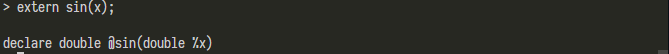
 
### Function definition

First apply for memory space, run the function body, and then return the result.

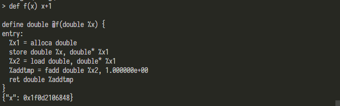
 
### Declaration, initialization and assignment of values

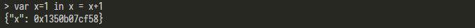
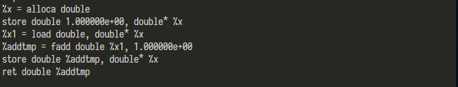
 
### Function call

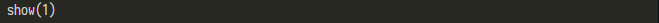

 
### Boolean expression definition

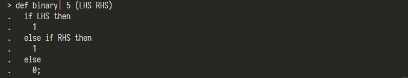
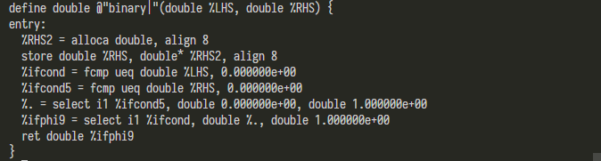
 
### if-then-else control flow

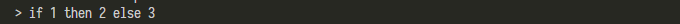
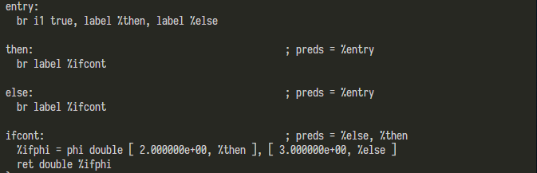
 
### for loop

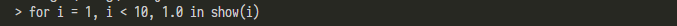
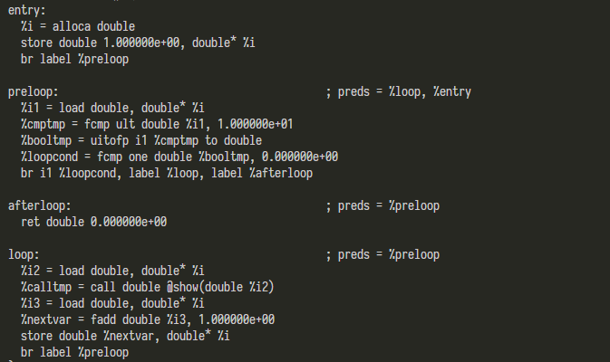
 
### Nested assignment complex evaluation expressions

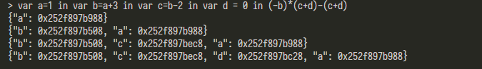
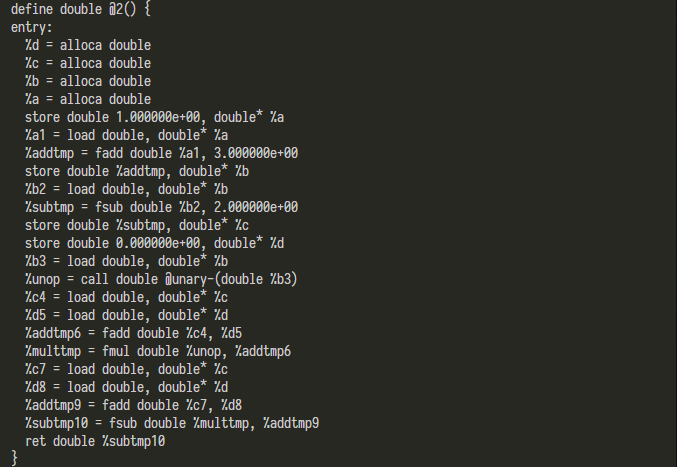

## 💻 Compiler Integration Results

Taking the `d: = (a-b) + (a-c) + (a-c)` assignment statement required in the instruction book as an example, a corresponding form in this language is:

```ocaml
var d = (var a=1,b=a+1,c=b+2 in (a-b)+(a-c)+(a-c)) in show(d)
```

### Token Mode

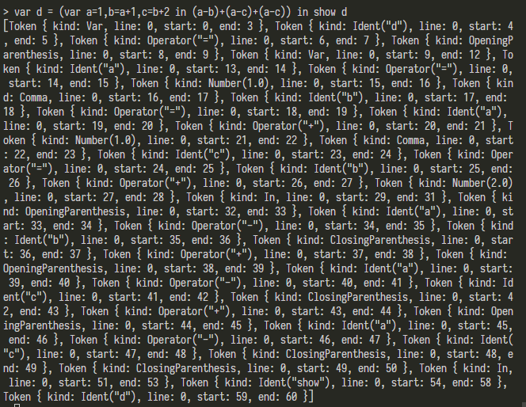

### AST Mode

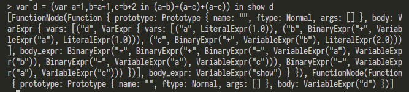

### Interpreter Mode

#### Symbol table

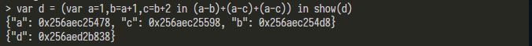

#### IR

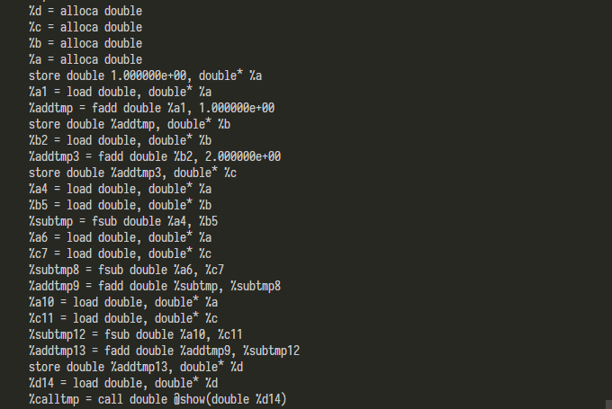

#### IR after Local Optimization


 
#### Side Effect and Return values

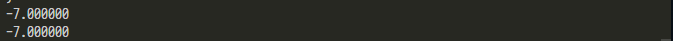

### JIT Mode

#### Global Optimization Results

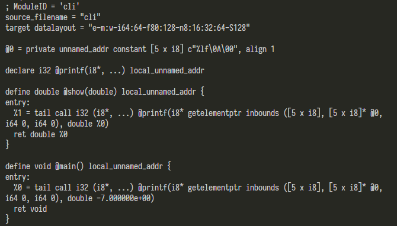
 
#### Execution Results

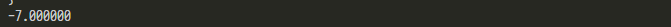

### Compiler Mode

Generated assembly results (partial):

```asm
main:
.seh_proc main
    subq    $40, %rsp
    .seh_stackalloc 40
    .seh_endprologue
    leaq    .L__unnamed_1(%rip), %rcx
    movq    __real@c01c000000000000(%rip), %xmm1
    movq    %xmm1, %rdx
    callq   printf
    nop
    addq    $40, %rsp
    retq
    .seh_handlerdata
    .text
    .seh_endproc

    .section    .rdata,"dr"
.L__unnamed_1:
    .asciz  "%lf\n"
```

## 😆 Optimized Case Analysis

There are too many optimizations, many joint effects, here are some examples:

### Useless Stack Read/Write Elimination (Direct Use of Registers)

See the figure below. This mode is `Interpreter` mode. The first line is the function definition `def f (x, y) x + y` entered by the user.

The first part of the output shows that because of the two incoming parameters, two stack memory spaces were first applied, the register values were written to the corresponding spaces, and then because they were to be used, they were immediately read into the registers, then added, and finally returned.

The second part is the symbol table, which confirms that the two stack symbols are indeed applied.


In fact, we can easily see that it is not necessary to read out immediately after saving at this time, and can be simplified.
The third part of the output confirms our idea, this part of the memory write and read is optimized away. Use registers directly.

### Constant Merge

Still use `(a-b) + (a-c) + (a-c)` as an example, as shown in the following figure:
For the calculation of deterministic values, the original code for generating the intermediate code is very long. In fact, the optimized code directly combines the constants to calculate the result `-7`.

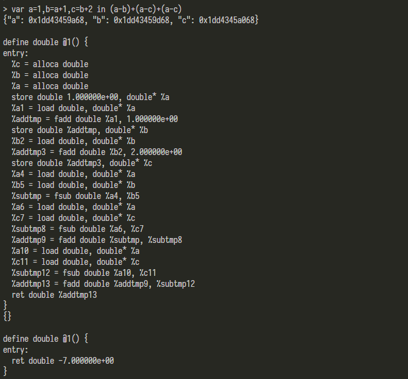

### Instruction Merge and Expression Merge

For the following function `def g1 (x, y) (x-y) + (x-y)` the original generated code evaluates each part of the expression.

In fact, we can obviously analyze that the results of `(x-y) (x-y)` can be combined.

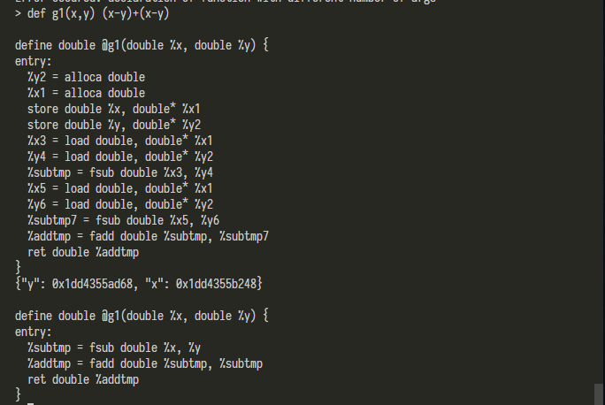

Observe the optimized code. First, the memory access is eliminated, then first use `%subtmp = fsub double %x,%y` to calculate the result of the subexpression, and then directly add the two results `%addtmp = fadd double %subtmp, %subtmp`, clearly meets our expectations for optimization.

### Tail Recursive Optimization

Analyzing the function `def tail_fn(x) if x <1 then x else tail_fn(x-1)`, is obviously a recursive function. In the else branch, we can find that it is a function call. When x is large It may cause the function call stack to overflow.

After analyzing the optimization results, it was found that there were no function calls and they were converted into loops.

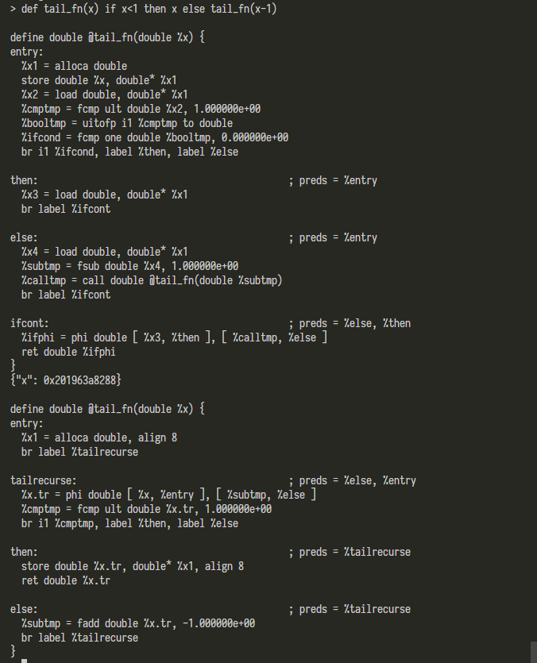

### Function Inlining

For the following set of definitions, we find that the & binary operator is called `!` The unary operator and the `|` binary operator perform a function operation to obtain the result. Finally, in an instruction, we use the & operator as a Boolean judgment condition to select the displayed result.

```ocaml
# Logical unary not.
def unary!(v)
  if v then
    0
  else
    1;

# Binary "logical or", (note that it does not "short circuit")
def binary| 5 (LHS RHS)
  if LHS then
    1
  else if RHS then
    1
  else
    0;

# Define = with slightly lower precedence than relationals.
def binary& 9 (LHS RHS)
  (!LHS | !RHS);

var x=1,y=0 in (if x&y then show(x) else show(y))
```

Let's first analyze the `&` operator as an example. As shown in the figure below, we notice that there are also useless memory reads and function calls before optimization.

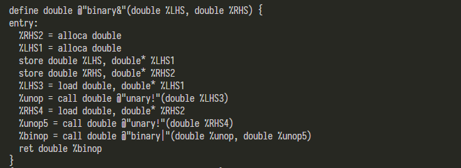

Since inline optimization can only be performed globally, we first observe the results of local optimization. Note that the local optimization just eliminates useless memory reads.

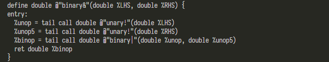

Then let's run in Jit mode to perform global optimization at the end. We noticed that the function call no longer exists in the `&` operator and was expanded into it.

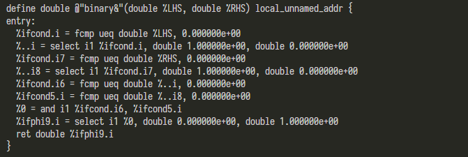

Further, we can observe that all of them are constant judgments. Our two comparison conditions are also constants. If the main function can be further inlined, will the last displayed result even be a constant?

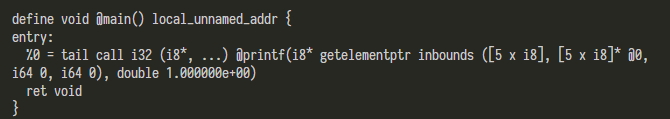

The result above proves our conjecture. The final result is directly printlf the result of a constant calculation. Observe the call chain.

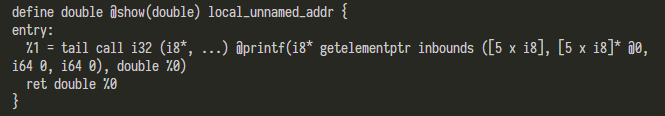

Confirming that show is indeed calling printf further proves our point.

## 🏷️ Author & License

[MIT](./LICENSE)

## 👍 Reference and Acknowledgement

- [LLVM Tutorial](https://llvm.org/docs/tutorial/index.html)
- [Iron-kaleidoscope](https://github.com/jauhien/iron-kaleidoscope)